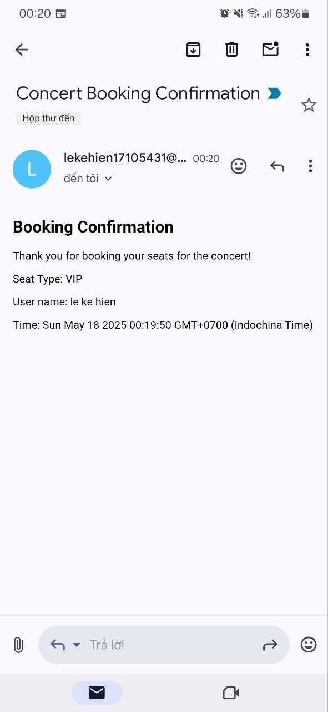

# Concert Ticket Booking System

A microservices-based concert ticket booking platform with high concurrency support and distributed locking.

## Architecture

The system consists of the following microservices:

1. **API Gateway** (Port 3000)
   - Entry point for all client requests
   - JWT token verification
   - Request routing to appropriate services

2. **Auth Service** (Port 3001)
   - User registration and authentication with manage session token with redis
   - JWT token generation
   - User profile management

3. **Concert Service** (Port 3003)
   - Concert management
   - Auto-disable bookings for past concerts with redis ttl

4. **Booking Service** (Port 3002)
   - Ticket booking operations
   - Concurrency control using Redis
   - Booking validation
   - Email confirmation 

## Prerequisites

- Docker and Docker Compose
- Node.js 18 or later
- MongoDB
- Redis

## Setup

1. Clone the repository:
   ```bash
   git clone <repository-url>
   cd test_concert
   ```

2. Modify_ENV in each service have .env.example  and change file to .env file:
   for password email : with gmail using app-password not regular password


3. build core module redis and shared module :
   ```bash
   cd shared
   npm run build
   ```

4. run each service :
   ```bash
   cd auth-service
   npm i
   npm run dev
   npm run worker
   cd ../booking-service
   npm i
   npm run dev
   npm run worker
   cd ../concert-service
   npm i
   npm run dev
   npm run worker
   cd ../api-gateway
   npm run dev
   ```

## API TEST
   go to post man api folder PostmanAPI and import json to your post man
   Postman import after register and login please add token Bear to authenciation post
## Images

### System design overview


### Booking ticket flow


### Email confirmation



## Task bonus Done 
   Simulated email confirmation.
	Use microservices architecture:
	At least: Auth, Concert, and Booking Services.
	Automatically disable bookings once the concert starts. (before 10s of the concert start call bull mq save to database )


## License

MIT 