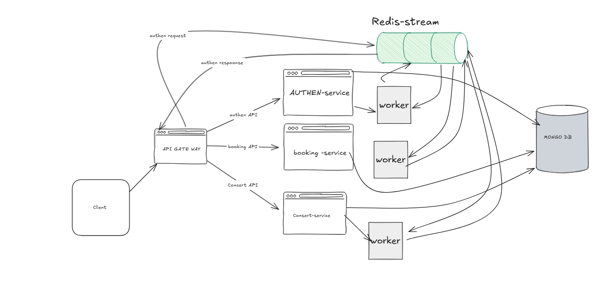
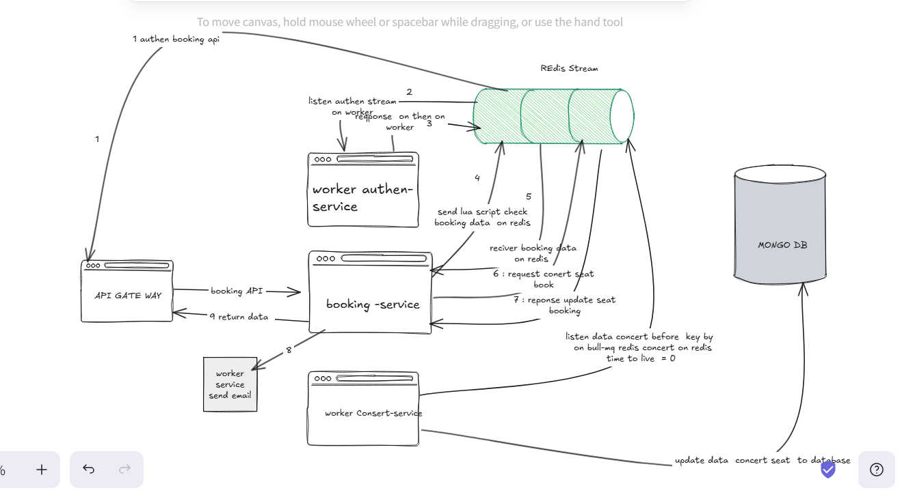

# Concert Ticket Booking System

A microservices-based concert ticket booking platform with high concurrency support and distributed locking.

## Architecture

The system consists of the following microservices:

1. **API Gateway** (Port 3000)
   - Entry point for all client requests
   - JWT token verification
   - Request routing to appropriate services

2. **Auth Service** (Port 3001)
   - User registration and authentication with manage session token with redis
   - JWT token generation
   - User profile management

3. **Concert Service** (Port 3003)
   - Concert management
   - Auto-disable bookings for past concerts with redis ttl

4. **Booking Service** (Port 3002)
   - Ticket booking operations
   - Concurrency control using Redis
   - Booking validation
   - Email confirmation 

## Prerequisites

- Docker and Docker Compose
- Node.js 18 or later
- MongoDB
- Redis

## Setup

1. Clone the repository:
   ```bash
   git clone <repository-url>
   cd test_concert
   ```

2. Modify_ENV in docker-compose.yml:
   env file mail  : With email password using app password not with your pass word (test success gmail)


3. Create `.env` files in each service directory with appropriate configurations.

4. Start the services using Docker Compose:
   ```bash
   docker compose up 
   ```

## Images

### System design overview


### Booking ticket flow


### Email confirmation


## Development

## Features

- JWT-based authentication
- Distributed locking with Redis
- MongoDB for data persistence
- Docker containerization
- Load testing support
- Mock email notifications
- Auto-disable bookings for past concerts

## Security

- JWT-based authentication
- Helmet for security headers
- Input validation
- Secure password hashing
- Environment variable configuration


## License

MIT 