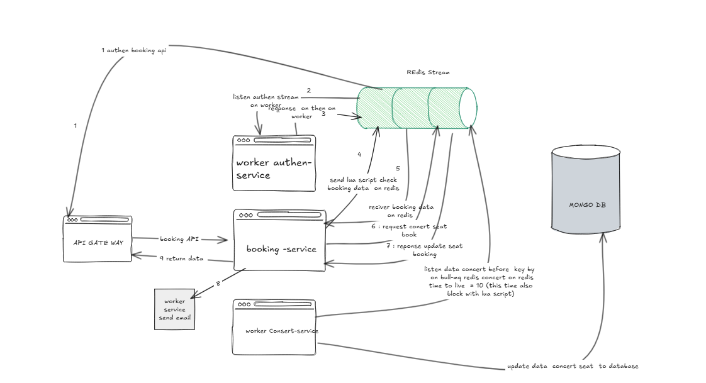

# Concert Ticket Booking System

A microservices-based concert ticket booking platform with high concurrency support and distributed locking.

## Architecture

The system consists of the following microservices:

1. **API Gateway** (Port 3000)
   - Entry point for all client requests
   - JWT token verification
   - Request routing to appropriate services

2. **Auth Service** (Port 3001)
   - User registration and authentication with manage session token with redis
   - JWT token generation
   - User profile management

3. **Concert Service** (Port 3003)
   - Concert management
   - Auto-disable bookings for past concerts with redis ttl

4. **Booking Service** (Port 3002)
   - Ticket booking operations
   - Concurrency control using Redis
   - Booking validation
   - Email confirmation 

## Prerequisites

- Docker and Docker Compose
- Node.js 18 or later
- MongoDB
- Redis

## Setup

1. Clone the repository:
   ```bash
   git clone <repository-url>
   cd test_concert
   ```

2. Modify_ENV in docker-compose.yml:
   for password email : with gmail using app-password not regular password


3. Start the services using Docker Compose:
   ```bash
   docker compose up 
   ```

## API TEST
   go to post man api folder PostmanAPI
   Postman import after register and login please add token Bear to authenciation post
## Images

### System design overview


### Booking ticket flow


### Email confirmation


## Development


## License

MIT 